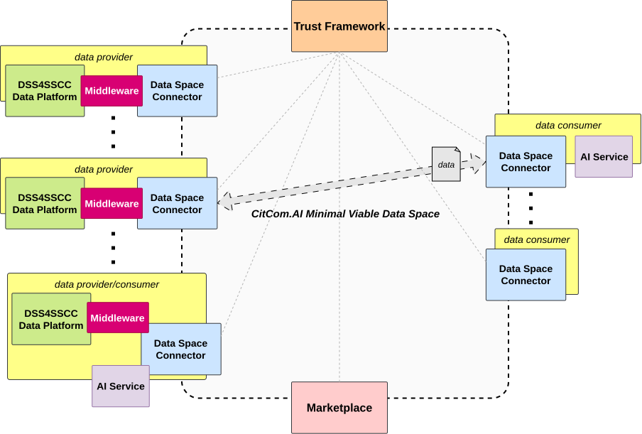

As explained in [Data Space Deployment - Minimum Viable Data Space](../getting_started/data_spaces/deployment.md#minimal-viable-data-space), the MVDS serves as a testing environment that facilitates the validation of data exchange models and a gradual migration from existing data platform to future data spaces, enabling progression from interoperability level 1 to level 2 ([Interoperability level](../getting_started/interoperability.md#interoperability-levels)).

## Cross-TEF Experiment

Following this MVDS approach, an initial experiment is proposed between different TEFs within the project, all operating at interoperability level 1. This cross-TEF experiment sets up a data space using Fiware technology.

## Tools

-   :material-rocket-outline:{ .lg .middle } __Verifier Credential Issuer__

    ---

    _description_

    [:octicons-arrow-right-24: Learn more](./vc_issuer.md)

-   :material-rocket-outline:{ .lg .middle } __Trust Frameworks__

    ---

    _description_

    [:octicons-arrow-right-24: Learn more](./trust_frameworks/index.md)

-   :material-rocket-outline:{ .lg .middle } __Connector__

    ---

    _description_

    [:octicons-arrow-right-24: Learn more](./connector.md)

